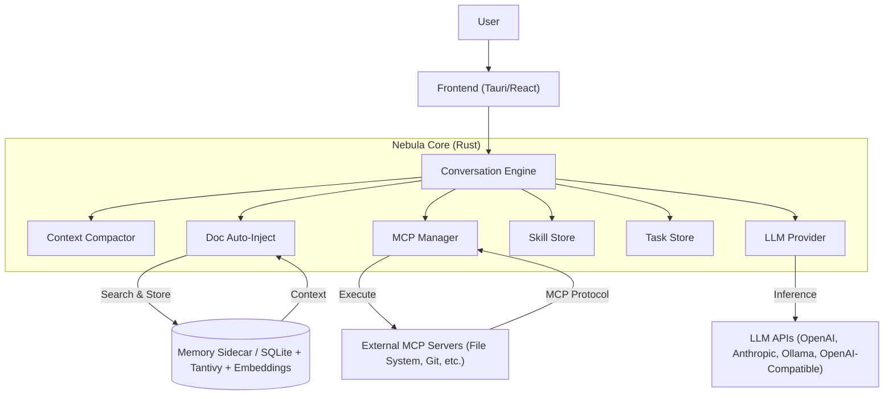

# Nebula

**Nebula** is a native, high-performance **Intelligent Orchestrator** designed to bridge user intent, personal memory, and external tools. Built with [Tauri](https://tauri.app/) and Rust, it serves as a privacy-first AI client that doesn't just chat—it *remembers* and *acts*.

Nebula is the result of my dissatisfaction with the chat clients available, and my desire to explore memory architectures for LLMs. Long term memory is a constant source of friction.

This code is mostly written by LLMs. See the HLD (`docs/nebula_hld_0.6.md`) for the design. I type some code in here or there, but as little as humanly possible. Clients that helped: Warp, Claude Code, Codex, Gemini, Antigravity, and Opencode. LLMs: Gemini Pro 2.5 and 3, Claude Opus, Sonnet, and Haiku; Deepseek 3.2, GLM 4.7, Devstral 3 small, and many others.

**Current version:** `v0.6.0`

### What's new in v0.6.0

- **Memory v3 (`memory3`)**: a redesigned long-term memory layer.
  - **Doc store**: markdown documents on disk under `memory/docs/`, chunked and embedded for semantic recall. Six LLM-callable tools (`memory_doc_remember`, `memory_doc_fetch`, `memory_doc_edit`, `memory_doc_forget`, `memory_doc_recall`, `memory_doc_link_context`).
  - **Knowledge-graph facts**: atomic `(subject, predicate, object)` triples in SQLite with `memory_fact_remember` / `memory_fact_recall` / `memory_fact_forget` tools. Auto-injected as prose alongside the top doc each turn.
  - **Auto-inject**: every user turn gets a deterministic recall + KG-prose block injected up front (tunable token budget and score floor). Replaces the older "Strategist" planner/synthesizer.
  - **Explicit fact extraction**: `/remember <text>` chat command, the per-message "Save as fact" action, and `memory_fact_remember` are the supported triggers. Per-turn LLM extraction is off by default; `session_end` and `off` policies are also available.
  - **Embeddings**: local `fastembed` (ONNX, `bge-small-en-v1.5`) or remote OpenAI-compatible embeddings (configurable per provider).
  - **Audit log**: every tool execution is recorded in `nebula.db` for transparency.
- **Skills**: discoverable, user-editable instruction bundles (markdown files with frontmatter) that the model can pull into context on demand via the `use_skill` LLM tool. Built-ins ship with the app; user skills live under `~/.config/.../skills/`. A filesystem watcher reloads changes live.
- **Task checklists**: per-conversation checklist persisted in SQLite. The built-in `update_tasks` tool lets the model maintain a visible plan; the **Tasks** side panel shows progress in real time. Auto-approved; can be disabled in Settings.
- **Streamable HTTP transport**: third MCP transport option alongside `stdio` and `sse`.
- **OpenAI-Compatible provider**: first-class support for LM Studio, OpenRouter, and other OpenAI-compatible endpoints in addition to OpenAI, Anthropic, and Ollama.
- **Reasoning & thinking controls**: per-model capability flags (`reasoning_effort`, thinking mode, Anthropic extended thinking) auto-detected from OpenRouter or configurable in Settings, with UI controls in the chat generation panel.
- **Context compaction**: tool-call-aware summarization of older turns; configurable in *Settings → Intelligence* with a dedicated support model. Most recent N messages are kept raw.
- **Tokens-per-second display**: live streaming throughput shown in the chat UI.
- **Per-message timestamps**: optional toggle in Appearance settings.
- **Themes**: Light, Dark, Solarized Light, Solarized Dark, Kimbie Dark, and Quiet Light.
- **Storage locations panel**: Settings shows the resolved paths for settings.json, the SQLite database, the full-text index, the docs store, and the skills directory, with click-to-open support.

## Key Features

### Deep Context & Memory

Unlike standard chat clients, Nebula features a **Memory Sidecar** (powered by SQLite + Tantivy + embeddings) that runs locally.

- **Episodic memory**: every message is indexed for full-text search via Tantivy (<100ms typical retrieval).
- **Doc store (memory3)**: long-form markdown notes are chunked and embedded for semantic recall. Each turn, the highest-scoring doc plus a handful of KG facts are auto-injected into the context.
- **Knowledge-graph facts**: atomic triples (`subject`, `predicate`, `object`) capture durable personal facts. Auto-rendered as prose next to the top doc, or queried on-demand by the model.
- **Embeddings, local or remote**: built-in `fastembed` (ONNX, 384-dim) ships with the app for fully offline operation; or point at any OpenAI-compatible `/embeddings` endpoint.
- **Smart pruning & compaction**: older turns are summarized via a configurable support model while keeping the most recent N messages raw. Tool-call-aware splitting prevents broken chains.
- **Index maintenance**: built-in tools to rebuild and optimize the search index if data gets out of sync.
- **Deletion support**: full support for deleting messages, conversations, docs, and facts from both the database and search index.
- **Global search**: instantly find any past message across all conversations using query-based full-text search.
- **Data portability**: JSON (lossless) and Markdown export options, plus JSON import to restore or migrate conversations.

### Native MCP Host

Nebula implements the **[Model Context Protocol (MCP)](https://modelcontextprotocol.io/)**, treating external tools as first-class citizens.

- **Connect tools**: give the AI access to your file system, Git repositories, browser automation, or anything else that speaks MCP.
- **Three transports**: `stdio` (subprocess), `sse` (Server-Sent Events), and `streamable-http` (HTTP streaming).
- **Security first**: granular "Human-in-the-loop" permissions. You verify every tool execution (Allow / Deny / Always Allow).
- **Permission policy**: allowlist / denylist per server to restrict tool access automatically; server-side enforcement ensures tools never run without approval.
- **Auto-approval**: toggle "Auto-Approve" for trusted servers or specific tools. Auto-approved tools run immediately without interrupting the chat flow; others fall back to manual confirmation.
- **Audit logging**: every tool execution is logged to the local SQLite database for transparency, including full inputs and outputs.
- **Token safety**: large tool outputs are automatically truncated for the LLM to save tokens; the full output is always viewable in the UI.
- **Tool management**: visual panel to view, search, and granularly enable/disable individual tools or entire servers.
- **Reliability**: built-in auto-reconnection with exponential backoff and connection status monitoring.

### Built-in Tools

In addition to MCP servers, Nebula exposes a small set of in-process tools to the LLM:

- **`memory_doc_*`** — remember / fetch / edit / forget / recall / link_context for markdown docs.
- **`memory_fact_*`** — remember / recall / forget for KG facts.
- **`update_tasks`** — replace the per-conversation task checklist; surfaced live in the Tasks side panel.
- **`use_skill` / `list_skills`** — pull a named instruction bundle (a "skill") into the conversation on demand.

Built-in tools are auto-approved by default since they only touch local, user-inspectable state. The `update_tasks` and memory tools can each be disabled in Settings.

### Skills

Skills are user-editable markdown files containing imperative instructions ("how to approach X"). They live on disk under the app config dir (`skills/` for user skills, `skills/built-ins/` for the bundled starter set), with a YAML frontmatter declaring `name` and `description`.

- The model sees only the list of available skill names + descriptions in its system prompt.
- When the model calls `use_skill <slug>`, the body of that skill is loaded into the conversation.
- A filesystem watcher reloads changes live; edit a skill in your editor and the next turn picks it up.
- Built-ins are restored on startup if deleted; user skills are yours to keep.

### Performance & Privacy

- **Local-first**: your memory stays on your machine.
- **Provider-agnostic**: unified interface for **OpenAI**, **Anthropic**, **Ollama**, and **OpenAI-Compatible** endpoints (LM Studio, OpenRouter, vLLM, etc.).
- **Optional keychain**: API keys can live in the system keychain instead of `settings.json`.
- **Model management**: toggle visibility for models, bulk enable/disable providers, **filter large model lists (typedown search)**, and **set a default model** for new chats.
- **Smart chat management**: auto-titles conversations, allows renaming/deleting, and intelligently handles chat deletion without unnecessary empty chats.
- **Searchable history**: filter conversations by title or search deep into message content directly from the sidebar.
- **Rust core**: heavy lifting (storage, search, MCP, compaction) is done in optimized Rust.

### Rich Chat Interface

- **Markdown rendering**: full GitHub-Flavored Markdown with tables, lists, headers, and KaTeX math.
- **Code highlighting**: syntax highlighting for code blocks with "Copy Code" functionality, styled to match the `vscDarkPlus` theme.
- **Interactive messages**: edit, copy, delete, save-as-fact, and regenerate messages on the fly.
- **Aesthetic UI**: polished, editor-like typography with custom scrollbars and clean spacing; configurable interface and chat fonts (family, size, weight).
- **Themes**: Light, Dark, Solarized Light, Solarized Dark, Kimbie Dark, Quiet Light.
- **File attachments**: support for generic file attachments (Text, Code, Images) with multi-modal LLM support.
- **Generation settings**: real-time control over **Temperature**, **Top P**, **Streaming**, and (where supported) **reasoning effort** / **thinking** / **extended thinking** directly from the chat interface.
- **Tokens-per-second**: live throughput display for streaming responses.
- **Per-message timestamps**: optional, toggleable in Appearance settings.
- **Stop generation**: instantly abort long-running LLM responses with a dedicated stop button.
- **Side panels**: **Memory Panel** shows the exact memory context being injected; **Tasks Panel** shows the current conversation's checklist.
- **Inline `<think>` parsing**: streamed `<think>...</think>` blocks are extracted into the reasoning channel automatically.
- **Chat commands**: `/remember <text>` runs explicit fact extraction over arbitrary text.

## Architecture

Nebula acts as an orchestrator between the user, the memory sidecar, and external MCP servers.



See `docs/nebula_hld_0.6.md` for the full High-Level Design document.

## Getting Started

### Prerequisites

- **Rust**: latest stable version.
- **Node.js**: v18+.
- **System dependencies**: standard Tauri prerequisites (e.g., `libwebkit2gtk-4.0-dev`, `build-essential`, etc. on Linux).

### Installation

1. **Clone the repository:**
   ```bash
   git clone https://github.com/jstevewhite/nebula_chat.git
   cd nebula_chat
   ```
2. **Install dependencies:**
   ```bash
   npm ci
   ```
   If you don't have a lockfile yet, you can use `npm install` instead.
3. **Run the development application (Vite + Tauri):**
   ```bash
   npm run tauri dev
   ```

### Linux Compatibility

On Linux, Nebula sets a small set of environment variables at startup to work around common quirks:

- IBus input / typing issues (`IBUS_ENABLE_SYNC_MODE`, `GTK_IM_MODULE=xim`).
- NVIDIA GPU rendering (`WEBKIT_DISABLE_DMABUF_RENDERER`).
- Touch / pointer event handling (`GDK_CORE_DEVICE_EVENTS`, `WEBKIT_DISABLE_COMPOSITING_MODE`).

These fixes are built into the binary, so DEB / RPM / AppImage packages work out of the box. If you build from source and hit issues, you can also export them yourself before launching.

## Configuration

Nebula uses a `settings.json` file stored in your system's app config directory (e.g. `~/.config/com.tauri-appnebula.app/settings.json` on Linux). You can configure providers, models, memory, MCP servers, skills, prompts, and appearance from the UI (recommended), or by editing the file directly. The Settings page surfaces the resolved paths to settings.json, the SQLite database, the full-text index, the docs store, and the skills directory.

Provider credentials can be set in `settings.json`, in the system keychain (when `enable_keychain` is true, the default), or via environment variables (`NEBULA_OPENAI_KEY`, `NEBULA_ANTHROPIC_KEY`).

### Example `settings.json`

```json
{
  "providers": {
    "openai": {
      "enabled": true,
      "api_key": "sk-...",
      "provider_type": "OpenAI"
    },
    "anthropic": {
      "enabled": true,
      "api_key": "sk-ant-...",
      "provider_type": "Anthropic"
    },
    "ollama": {
      "enabled": true,
      "base_url": "http://localhost:11434",
      "provider_type": "Ollama"
    },
    "openrouter": {
      "enabled": true,
      "api_key": "sk-or-...",
      "base_url": "https://openrouter.ai/api/v1",
      "provider_type": "OpenAICompatible"
    }
  },
  "default_model": "openai::gpt-4o",
  "context_model": "openai::gpt-4o-mini",
  "memory_enabled": true,
  "memory_auto_inject_docs": true,
  "memory_auto_inject_token_budget": 4000,
  "memory_recall_score_floor": 0.20,
  "memory_embedding_provider": "fastembed",
  "memory_fastembed_model": "bge-small-en-v1.5",
  "fact_extraction_policy": "explicit",
  "context_turns": 0,
  "context_uncompressed_msg_count": 20,
  "mcp_servers": {
    "filesystem": {
      "type": "Stdio",
      "command": "npx",
      "args": ["-y", "@modelcontextprotocol/server-filesystem", "/home/user/workspace"],
      "env": {
        "SOME_FLAG": "1"
      },
      "auto_approve": false,
      "auto_approve_tools": [],
      "permissions": {
        "allowlist": [],
        "denylist": []
      }
    },
    "remote-sse": {
      "type": "Sse",
      "url": "http://localhost:3000/mcp",
      "headers": {}
    },
    "remote-http": {
      "type": "StreamableHttp",
      "url": "http://localhost:3001/mcp",
      "headers": {
        "Authorization": "Bearer ..."
      }
    }
  }
}
```

### Settings Notes

- `memory_enabled`: master toggle for long-term memory retrieval and injection.
- `memory_auto_inject_docs`: when true, every user turn prepends the top doc + KG-fact block; when false, the model can still call `memory_*` tools on demand.
- `memory_auto_inject_token_budget`: hard cap on the auto-injected memory block (default 4000).
- `memory_recall_score_floor`: minimum fusion score for a doc to be auto-injected (default 0.20).
- `memory_embedding_provider`: `"fastembed"` (local ONNX) or `"remote"` (uses an OpenAI-compatible embeddings endpoint from `providers`, identified by `memory_remote_embedding_provider_id`).
- `fact_extraction_policy`: `"explicit"` (default — `/remember`, "Save as fact", and `memory_fact_remember` only), `"session_end"` (also extract on conversation switch), or `"off"`.
- `context_model`: used for context compaction and fact extraction. Format: `"<provider_id>::<model_id>"`.
- `context_turns`: number of recent conversation turns explicitly included during context assembly (0 disables).
- `context_uncompressed_msg_count`: most recent N messages kept raw before older ones are summarized (default 20).
- `disable_builtin_task_tool`: hides the built-in `update_tasks` tool from the LLM.
- `memory_tools_auto_approve`: auto-approve `memory_doc_*` / `memory_fact_*` calls (default true).
- `mcp_servers.*.env`: optional environment variables for `Stdio` servers (same format as `process.env`).
- `mcp_servers.*.headers`: optional HTTP headers for `Sse` and `StreamableHttp` servers (e.g. for `Authorization`).

## Development

### Frontend (React + Vite)

```bash
npm install
npm run dev      # Vite dev server (UI only)
npm run build    # TypeScript + Vite production build
```

### Full Tauri App

```bash
npm run tauri dev      # Run Rust backend + React frontend together
npm run tauri build    # Build production app bundle
```

### Rust Backend

```bash
cd src-tauri
cargo build
cargo test
cargo clippy
```

## Tech Stack

- **Frontend**: React 19, Vite 7, TailwindCSS 4, Lucide Icons, `react-markdown`, `react-syntax-highlighter`, KaTeX.
- **Backend**: Rust, Tauri v2, Tokio.
- **Storage / Search**: SQLite (rusqlite), Tantivy (full-text), `fastembed-rs` (local ONNX embeddings).
- **Communication**: Tauri IPC, JSON-RPC 2.0 (for MCP) over stdio / SSE / streamable HTTP.

## License

[MIT](LICENSE)
